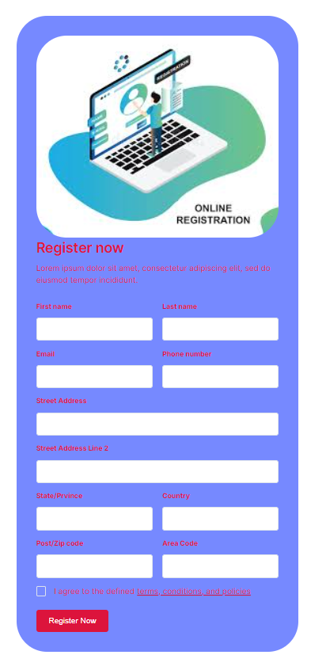

# Django Project preview

## Welcome! 👋

### Your users should be able to: 

- View the optimal layout for the component depending on their device's screen size
- This web page template allows users to enter basic details through a simple form interface. The entered data is then securely saved into an SQL Server database using the Django framework, ensuring efficient data management and retrieval for further processing or analysis.

### Use Font
- Font Family : [Inter](https://fonts.googleapis.com/css2?family=Inter:wght@400;500;600;700&display=swap)

